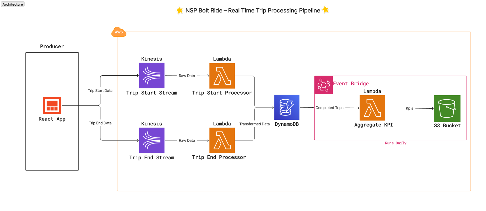
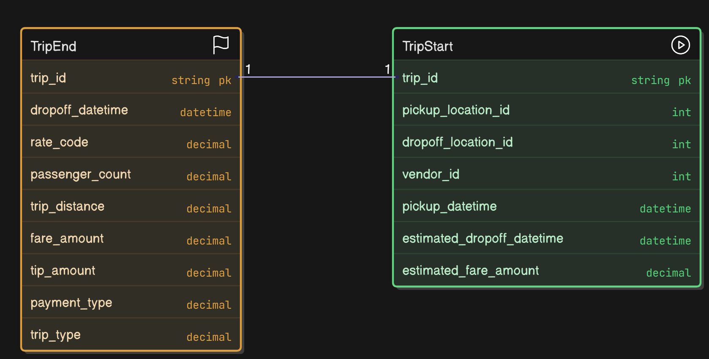

# 🚕 Real-time Trip Data Processing System

This project implements a real-time data processing system for trip data using AWS services. The solution processes trip start and end events through Kinesis streams, stores trip data in DynamoDB, and generates daily KPI metrics.

## 📌 Project Overview

The system implements three main Lambda functions:

- **Trip Start Processing**: Captures and processes trip start events
- **Trip End Processing**: Handles trip completion and updates trip status
- **KPI Aggregation**: Generates daily metrics including total fare, trip counts, and fare statistics

## 🏛️ Architecture


_Figure 1: System Architecture showing the flow of trip data through AWS services_

<details>
<summary>📊 Data Model</summary>


_Figure 2: Entity Relationship Diagram showing the data model_

</details>

<details>
<summary>🏗️ Project Structure</summary>

```
├── assets/                # Static assets and resources
│   └── images/           # Architecture and workflow diagrams
├── aws infra/            # AWS infrastructure configuration
│   ├── main.tf          # Main Terraform configuration
│   ├── lambda.tf        # Lambda function definitions
│   ├── kinesis.tf       # Kinesis stream configuration
│   ├── dynamodb.tf      # DynamoDB table setup
│   ├── event-bridge.tf  # EventBridge rules
│   ├── s3.tf           # S3 bucket configuration
│   ├── iam.tf          # IAM roles and policies
│   └── output.tf       # Terraform outputs
├── data/                 # Sample data files
│   ├── trip_start.csv  # Sample trip start events
│   └── trip_end.csv    # Sample trip end events
├── producer/            # Streamlit producer application
│   ├── app.py          # Streamlit application code
│   └── requirements.txt # Producer app dependencies
├── scripts/             # Lambda function implementations
│   └── lambda/
│       ├── trip_start.py      # Process trip start events
│       ├── trip_end.py        # Process trip end events
│       └── aggregate_kpi.py   # Aggregate trip KPIs
└── .gitignore          # Git ignore configuration
```

</details>

<details open>
<summary>🧰 Core Technologies</summary>

| Technology      | Purpose                                 |
| --------------- | --------------------------------------- |
| AWS Lambda      | Serverless compute for event processing |
| AWS Kinesis     | Real-time data streaming                |
| AWS DynamoDB    | NoSQL database for trip data            |
| AWS EventBridge | Event-driven architecture               |
| Terraform       | Infrastructure as Code                  |
| Python          | Lambda function implementation          |
| Boto3           | AWS SDK for Python                      |
| Streamlit       | Web interface for data producer         |

</details>

<details open>
<summary>🔄 Data Flow</summary>

1. **Data Production**

   - Streamlit app reads CSV files
   - Sends trip events to Kinesis streams
   - Supports both trip start and end events
   - Includes progress tracking and control

2. **Trip Start Processing**

   - Receives trip start events via Kinesis
   - Validates and processes trip data
   - Stores initial trip record in DynamoDB

3. **Trip End Processing**

   - Receives trip end events via Kinesis
   - Updates trip status to completed
   - Calculates final trip metrics

4. **KPI Aggregation**
   - Runs daily to aggregate metrics
   - Calculates total fare, trip counts, and statistics
   - Stores results in S3 for analysis

</details>

<details open>
<summary>📊 Key Metrics</summary>

The system calculates the following daily metrics:

- Total fare amount
- Number of completed trips
- Average fare per trip
- Maximum fare amount
- Minimum fare amount

</details>

<details open>
<summary>🛠️ Setup Instructions</summary>

### Prerequisites

- Python 3.9
- AWS CLI configured with appropriate credentials
- Terraform installed
- Git

### Installation

1. Clone the repository:

   ```bash
   git clone [your-repository-url]
   cd [project-directory]
   ```

2. Install dependencies:

   ```bash
   pip install -r requirements.txt
   ```

3. Configure AWS credentials:

   ```bash
   aws configure
   ```

4. Deploy infrastructure:

   ```bash
   cd aws_infra
   terraform init
   terraform plan
   terraform apply
   ```

5. Start the producer app:
   ```bash
   cd producer
   pip install -r requirements.txt
   streamlit run app.py
   ```

</details>

<details open>
<summary>📂 Outputs</summary>

The following outputs are generated by the system:

- **Sample Data Screenshot**: A snapshot of the sample data loaded into the system is available in the `assets/output/dynamo_ss.png` file.
- **KPI Metrics**: The computed daily KPIs, representing the final result of the pipeline run, are saved in the `assets/output/metrics.json` file.

</details>

## 📝 License

This project is licensed under the MIT License - see the [LICENSE](LICENSE) file for details.

## 👥 Contributing

Contributions are welcome! Please feel free to submit a Pull Request.

## 📧 Contact

For any questions or concerns, please open an issue in the repository.
